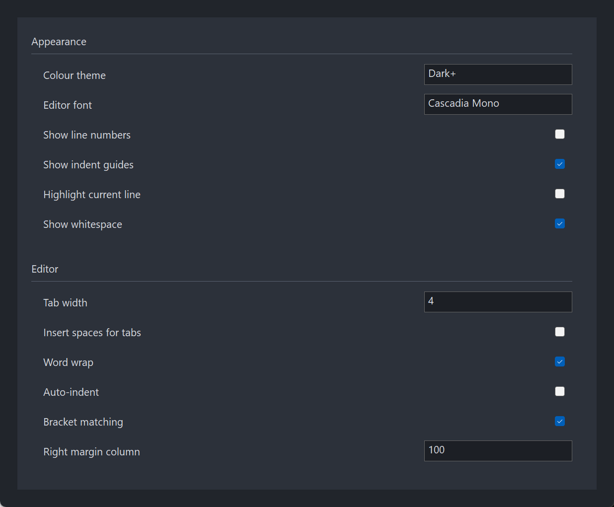

# PsScrollPanel

A scrolling panel for FreeBASIC Win32 applications: a viewport onto a page of ordinary child
controls that is taller than the space available for it, with a vertical scrollbar in a
reserved strip down the right edge.

It is the container behind a settings dialog whose list of options runs past one screen. You
build your page of labels, checkboxes and edit boxes exactly as you would on a plain window,
lay them out once, and the control does the scrolling by **moving the whole page** underneath
the viewport. Your controls keep the coordinates you gave them, forever.

The scrollbar's thumb is normally invisible. It appears when the cursor is over the control or
when something on the page has the focus, so the scrollbar reads as a hint rather than as
furniture — but the strip it lives in is always reserved, so nothing on your page ever shifts
sideways.

**The one thing to get right: your controls are parented to `PsScrollPanel_GetPanel()`, never to
the control's own handle.** A control created on the control itself sits over the viewport and
never scrolls.

---

## What it looks like



A settings page taller than its viewport. The scrollbar **is not visible here, and that is correct** — the thumb appears only when the content overflows *and* the pointer is over the control or focus is inside the page. The strip it lives in stays reserved either way, so nothing on the page shifts when it appears. The host parents its controls to the panel, never to the container.

---

## Requirements

**Files to copy into your project:**

| File | Purpose |
|---|---|
| `PsScrollPanel.bi` | Declarations — types, callbacks, constants, function prototypes |
| `PsScrollPanel.inc` | Implementation |
| `PsVScrollBar.bi` | The vertical scrollbar the control creates and owns |
| `PsVScrollBar.inc` | Its implementation |
| `PsBufferPaint.bi` | The flicker-free drawing surface both controls paint through |
| `PsBufferPaint.inc` | Its implementation |

**AfxNova is required.** The control is built on `CWindow`, and `PsBufferPaint` draws through
`AfxNova\CGdiPlus.inc`. Sources include AfxNova relative to the workspace root
(`#include once "AfxNova\CWindow.inc"`), so builds need the workspace root on the include
path:

```bash
fbc64.exe -i "C:\dev" main.bas
```

**Include order.** `PsScrollPanel.bi` pulls in `PsBufferPaint.bi` and `PsVScrollBar.bi` for the
types it names, but the three implementation files must be included in dependency order:

```freebasic
#include once "PsBufferPaint.inc"
#include once "PsVScrollBar.inc"
#include once "PsScrollPanel.inc"
```

**GDI+ must be running before the first repaint and must outlive the last one.** Both controls
render their geometry through GDI+, so bracket your message loop:

```freebasic
dim as ULONG_PTR gdipToken = AfxGdipInit()
' ... create windows, run the message loop ...
AfxGdipShutdown( gdipToken )
```

`AfxGdipShutdown` must come after every window is destroyed, because each repaint builds and
tears down a `PsBufferPaint`.

**Never name an identifier `ok`.** GDI+ defines `Ok = 0` as a `Status` enum value in namespace
`AfxNova`, and hosts customarily say `using AfxNova`. An existing variable, parameter or
function called `ok` becomes a duplicate definition the moment you adopt these files. Use
`bOK` instead.

**There is no message-filter obligation.** The control installs no pump filter and exports
none: it needs nothing from your message loop in order to work.

**For Tab navigation into the page, call `IsDialogMessage` in your message pump.** The controls
on the page are ordinary tabstops, and only the dialog manager moves focus between them:

```freebasic
do while GetMessage( @uMsg, null, 0, 0 )
    if uMsg.message = WM_QUIT then exit do
    if IsDialogMessage( hWndForm, @uMsg ) = 0 then
        TranslateMessage @uMsg
        DispatchMessage @uMsg
    end if
loop
```

Both of the control's own windows already carry `WS_EX_CONTROLPARENT`, which is what allows
`IsDialogMessage` to recurse past the viewport and reach the page. Without the pump call, Tab
does nothing inside the page — and the focus-into-view scroll goes with it, since nothing ever
changes focus.

### Host obligations, in full

1. **Parent your controls to `PsScrollPanel_GetPanel()`**, never to the control itself.
2. **Bracket your message loop with `AfxGdipInit` / `AfxGdipShutdown`.**
3. **Never name an identifier `ok`.**
4. **Call `IsDialogMessage` in your pump** if you want Tab to reach the page.
5. **Tell the control how tall the page is** — return a height from the layout callback, or
   call `PsScrollPanel_SetContentHeight` / `PsScrollPanel_AutoSizeContent`. Left at 0, the page
   is stretched to the viewport and nothing scrolls.
6. **Call `PsScrollPanel_Recalc`** after adding, removing, hiding or moving children outside of
   a resize. The control does not watch the page for you.
7. **Keep ownership of any `HFONT` you pass to `PsScrollPanel_SetFont`.** The control never
   deletes it, and it must outlive the page.

---

## Quick start

```freebasic
' 1. Create it, theme it, wire it up. Created zero-sized and hidden.
ghScrollPanel = PsScrollPanel_Create( HWND_FRMMAIN, IDC_FRMMAIN_SCROLLPANEL )
PsScrollPanel_SetColors( ghScrollPanel, theme.BackColorBox, theme.ForeColor )
PsScrollPanel_SetScrollBarColors( ghScrollPanel, theme.BackColorBox, _
                                 theme.ForeColorScrollBar, theme.ForeColorScrollBarHot )
PsScrollPanel_SetLayoutCallback( ghScrollPanel, @ScrollPanel_Layout )
PsScrollPanel_SetLineHeight( ghScrollPanel, ROW_HEIGHT + ROW_GAP )   ' one notch ~ 3 rows

' 2. Build the page. EVERY control is parented to the PANEL, never to ghScrollPanel.
dim as HWND hPage = PsScrollPanel_GetPanel( ghScrollPanel )
hChk = CreateWindowExW( 0, @wstr("BUTTON"), @wstr("Word wrap"), _
                        WS_CHILD or WS_VISIBLE or WS_TABSTOP or BS_AUTOCHECKBOX, _
                        0, 0, 0, 0, hPage, _
                        cast(HMENU, cast(LONG_PTR, IDC_WRAP)), hInst, NULL )

' 3. Font the page, once it is built.
PsScrollPanel_SetFont( ghScrollPanel, ghFont(GUIFONT_9) )

' 4. Size and show it. The layout callback runs from here and on every later resize.
SetWindowPos( ghScrollPanel, 0, x, y, cx, cy, SWP_NOZORDER or SWP_SHOWWINDOW )
```

And the layout callback — the only place your controls are ever positioned:

```freebasic
function ScrollPanel_Layout( byval hPanel as HWND, byval cxPanel as integer ) as integer
    dim as integer y = 16
    SetWindowPos( hChk, 0, 16, y, cxPanel - 32, 24, SWP_NOZORDER )
    y += 34
    ' ... the rest of the page, in PAGE coordinates ...
    return y + 16          ' the new content height. 0 = leave it unchanged.
end function
```

Notice what the callback does *not* do: it never touches the scroll position, never resizes the
page window, and never calls `GetClientRect( hPanel )` — the width it must lay out against is
handed to it as `cxPanel`.

If you would rather not track the height yourself, position the controls and call
`PsScrollPanel_AutoSizeContent( h, padding )`, which measures the deepest visible child.

That is the whole minimum. Everything below is refinement.

---

## Concepts

### Three windows

```
PsScrollPanel container HWND      WS_CLIPCHILDREN -- this is the VIEWPORT
├── panel (CWindow)              the PAGE. As tall as the content.
│     └── your controls          parented HERE, laid out in PAGE coordinates, once
└── PsVScrollBar                  a reserved strip on the right edge
```

`PsScrollPanel_Create` returns the **container**. It is an ordinary window handle, not an opaque
type, so you place and size it with `SetWindowPos` and find it with `GetDlgItem` on the
`CtrlID` you passed. The container's id is `CtrlID`; the panel takes `CtrlID + 1` and the
scrollbar `CtrlID + 2`.

`PsScrollPanel_GetPanel` returns the **page**, and that is the parent for everything you put on
it. The page is as wide as the viewport minus the reserved strip, and as tall as the content
height you declare (or the viewport, whichever is larger).

The control frees itself when its window is destroyed, including both child windows and the
brush it hands to `WM_CTLCOLOR*`. Your controls are children of the page, so they are destroyed
with it — do not `DestroyWindow` them yourself afterwards.

### Scrolling moves the page

The scroll position is applied as `SetWindowPos( hPanel, 0, -nPos, … )`. The page's top edge
in the container's client coordinates is always exactly `-nPos`. The container's
`WS_CLIPCHILDREN` clips, and USER32 blits the whole subtree in one go.

The consequence is the point of the control: **your controls are laid out exactly once per
resize and never touched again.** Scrolling repositions nothing, so a page of fifty controls
scrolls as cheaply as a page of five, and your layout code never has to know the scroll
position exists.

### Everything is in pixels

Content height, scroll position, `EnsureVisible` margins, wheel step — all pixels, all in page
coordinates. There are no lines, rows or scroll units to convert.

The two unscaled inputs are the strip width and the wheel line height: you pass those at 100%
DPI and the control scales them at use.

### Who owns layout

| Thing | Owner |
|---|---|
| Where your controls sit on the page | You, in the layout callback |
| How tall the page is | You, by return value or `SetContentHeight` / `AutoSizeContent` |
| The page's width, height and position | The control |
| The strip's rectangle | The control |
| The scroll position, and its clamping | The control |

The layout callback is called with the width the page is *being given*, before any of your code
runs, so it can never reason about a stale width. Calling `PsScrollPanel_SetContentHeight` from
inside it is safe: the control records the value rather than starting a second layout pass.

### The thumb is normally invisible

The thumb is shown when:

```
there is something to scroll   AND   ( the cursor is over the control  OR  focus is on the page )
```

Either of the last two alone is enough, so a keyboard-only user Tabbing through the page still
sees where they are. `PsScrollPanel_ShouldShow( bNeeds, bMouse, bFocus )` is that rule as a pure
function, with the full truth table:

| `bNeeds` | `bMouse` | `bFocus` | Result |
|:---:|:---:|:---:|:---:|
| FALSE | FALSE | FALSE | FALSE |
| FALSE | TRUE | FALSE | FALSE |
| FALSE | FALSE | TRUE | FALSE |
| FALSE | TRUE | TRUE | FALSE |
| TRUE | FALSE | FALSE | FALSE |
| TRUE | TRUE | FALSE | **TRUE** |
| TRUE | FALSE | TRUE | **TRUE** |
| TRUE | TRUE | TRUE | **TRUE** |

"The cursor is over the control" is a geometric test against the container's client rectangle,
so a cursor resting on one of your edit boxes still counts. "Focus is on the page" is true for
the page itself and for any descendant of it.

One override: while the user is dragging the thumb, it stays visible even if the cursor slides
off the strip sideways.

### The strip stays reserved

When the thumb hides, only the **bar window** goes; its strip of width keeps its place. The
page's width therefore never changes as the mouse comes and goes, which is what stops a page
full of right-aligned controls from jittering every time the cursor crosses the boundary.

The strip is not visible when it is empty because the bar's background colour tracks the page's
background — `PsScrollPanel_SetColors` pushes it through. The container paints itself in the
same colour, and with `WS_CLIPCHILDREN` that fill can only ever reach the strip.

### The reveal is polled

A 100 ms timer re-evaluates the rule, rather than `TrackMouseEvent`. The cursor can enter the
control directly over one of *your* child controls — an `EDIT`, a checkbox — in which case
neither the container nor the page ever receives a `WM_MOUSEMOVE`, and there is no message to
hang a leave-tracking request off. A periodic cursor test sees it regardless.

The timer runs only while there is something to scroll, and stops when the control is hidden.
The practical effect is that the thumb can appear or disappear up to 100 ms after the cursor
crosses the edge.

The same tick carries the focus-into-view scroll. It fires on a focus **change** only: a user
who deliberately scrolls the focused control off screen does not have it yanked back under
them on the next tick.

### Message forwarding

The page is the parent of your controls, so two families of message land there rather than on
your form.

**`WM_CTLCOLORSTATIC` / `BTN` / `EDIT` / `LISTBOX`** are answered by the control itself, using
the colours from `PsScrollPanel_SetColors`. That is why one call themes a whole settings page of
plain labels and checkboxes with no host code at all. Your message callback gets first refusal,
which is how you give (say) every `EDIT` a lighter background than the page — and it is why
`SCP_MESSAGEINFO` carries an `lResult` field, since those messages answer with an `HBRUSH`.

**`WM_COMMAND` / `WM_NOTIFY` / `WM_HSCROLL` / `WM_VSCROLL`** are offered to your message
callback and, if not claimed, **forwarded to the container's parent** — the window that would
have received them if the page were not there. So an existing page keeps working unchanged when
it moves onto a PsScrollPanel: your form's own `WM_COMMAND` handler still sees its controls.
Claim them in the callback only if you want them *instead of*, not as well as, that.

### The mouse wheel converts units

The system's wheel setting (`SPI_GETWHEELSCROLLLINES`) counts **lines**; this control's range
is **pixels**. The conversion happens at this boundary: one notch is `system lines ×
PsScrollPanel_SetLineHeight`, re-read per message so a Control Panel change takes effect
immediately. If the system is set to `WHEEL_PAGESCROLL`, one notch is the viewport height.

Set the line height to your settings row's pitch and one notch moves whole rows. Sub-notch
deltas from a precision trackpad accumulate rather than being discarded, so a slow swipe
scrolls smoothly.

The wheel is handled on both the container and the page, so a gesture anywhere over the control
scrolls it. Your own controls that ignore the wheel bubble it up through `DefWindowProc`, which
is the parent direction, so an `EDIT` under the cursor costs nothing.

### Programmatic changes are silent

`PsScrollPanel_SetPos`, `ScrollBy`, `SetContentHeight` and `EnsureVisible` never fire the scroll
callback. It reports **user** action — wheel, thumb drag, track paging, and the focus-into-view
scroll a Tab causes — and nothing else. That is what makes it safe to call any of those setters
from inside your own scroll handler without re-entering yourself.

---

## Behaviour and limits

Firm properties of the control, not settings:

- **Vertical only.** There is no horizontal scrolling and no horizontal scrollbar. The page is
  always exactly as wide as the viewport minus the reserved strip, and content wider than that
  is clipped. Re-flow to the width you are handed in the layout callback.
- **The page is never shorter than the viewport.** A content height below the viewport height
  is stretched to fill it, so the container's own fill can only ever show through in the strip.
- **You own the content height.** The control cannot know whether a collapsed section still
  counts, so it never guesses. Left at 0, nothing scrolls.
- **The control does not watch the page.** Adding, removing, hiding or moving a child outside of
  a resize needs a `PsScrollPanel_Recalc` before the scroll range reflects it.
- **`PsScrollPanel_SetFont` applies to existing children only.** Controls created afterwards keep
  the system font until you call it again.
- **No mouse capture is taken anywhere in this control.** It tracks no press state and owns no
  drag; the scrollbar takes its own capture for a thumb drag, inside its own window.
- **Double-clicks are not handled and not reported.** `WM_LBUTTONDBLCLK` is not offered to the
  message callback and falls through to `DefWindowProc`. Double-clicks on your own controls are
  unaffected — they are delivered to those controls, not to the page.
- **The reveal decision lags by up to 100 ms**, because it is polled rather than tracked.
- **Only the page forwards unclaimed `WM_COMMAND` / `WM_NOTIFY` / `WM_HSCROLL` / `WM_VSCROLL`
  to the container's parent.** The container offers `WM_COMMAND` and `WM_NOTIFY` to your
  message callback but does not forward them, because your controls do not live there.
- **`PsScrollPanel_EnsureVisible` refuses a window that is not a descendant of the page**,
  returning FALSE rather than scrolling somewhere arbitrary.
- **The page's window class drops `CS_HREDRAW` and `CS_VREDRAW`.** A window full of controls
  flickers heavily with them; the control invalidates deliberately instead.
- **Your controls are destroyed with the page.** Do not `DestroyWindow` them after the control
  has gone.

---

## API reference

### Creation

| Function | Description |
|---|---|
| `PsScrollPanel_Create( hWndParent, CtrlID ) as HWND` | Creates the control as a child of `hWndParent` and returns the **container's** handle. Styles are `WS_CHILD`, `WS_CLIPSIBLINGS` and `WS_CLIPCHILDREN` with `WS_EX_CONTROLPARENT`; `WS_VISIBLE` is deliberately absent, so the control is created zero-sized and hidden. Place, size and show it with `SetWindowPos`. `CtrlID` becomes the container's `GWLP_ID`; the page takes `CtrlID + 1` and the scrollbar `CtrlID + 2`. |
| `PsScrollPanel_GetPanel( hScp ) as HWND` | The page. **Parent every control you put on the page to this handle**, and lay them out in page coordinates. A control parented to the container instead would sit over the viewport and never scroll. |
| `PsScrollPanel_GetScrollBar( hScp ) as HWND` | The owned `PsVScrollBar`, for anything this API does not expose. Do not show, hide, move or resize it — the control owns its visibility and its rectangle. |

### The page

| Function | Description |
|---|---|
| `PsScrollPanel_SetContentHeight( hScp, nHeight )` | Declares how tall the page is, in pixels. Clamped to a minimum of 0; a no-op when the value is unchanged. Re-clamps the current position, re-sizes the page and re-syncs the scrollbar. **Silent.** Safe to call from inside the layout callback, where it records the value and lets that pass finish rather than starting another. |
| `PsScrollPanel_GetContentHeight( hScp ) as integer` | The declared content height. Note this is the *declared* value, which may be less than the page window's actual height when the page is shorter than the viewport. |
| `PsScrollPanel_AutoSizeContent( hScp, bottomPadding = 0 ) as integer` | Measures the bottom edge of the deepest **visible** child of the page, adds `bottomPadding`, pushes the result through `SetContentHeight` and returns it. Hidden children are skipped, so a collapsed section leaves no tail of empty page behind it. With no visible children it returns 0 and the padding is not added. |
| `PsScrollPanel_Recalc( hScp )` | Forces a full layout pass — the layout callback, the page geometry, the strip, the scrollbar sync — and repaints the page. Call it after adding, removing, hiding or moving children outside of a resize. |
| `PsScrollPanel_SetFont( hScp, hFont )` | Sends `WM_SETFONT` to every **existing** child of the page. Call it after building the page. **You keep ownership of the `HFONT`**; the control never deletes it, and the font must outlive the page. |

### Scrolling

All positions are pixels in page coordinates. Every one of these except `HandleWheelDelta` is
**silent** — it does not fire the scroll callback.

| Function | Description |
|---|---|
| `PsScrollPanel_GetPos( hScp ) as integer` | The current scroll offset: the page's first visible row of pixels. The page's top edge in container coordinates is `-GetPos()`. |
| `PsScrollPanel_SetPos( hScp, nPosition )` | Moves the page there, clamped to `0 … contentHeight - viewportHeight`. Silent. |
| `PsScrollPanel_ScrollBy( hScp, nDelta ) as boolean` | Moves relative to the current position, clamped the same way. Returns TRUE only if the position actually changed — so it reports FALSE at either end. Silent. |
| `PsScrollPanel_EnsureVisible( hScp, hChild, nMargin = 0 ) as boolean` | Scrolls the **minimum** distance that brings `hChild` fully into view, with `nMargin` pixels of clearance above and below. A child taller than the viewport is top-aligned instead. Returns FALSE and does nothing if `hChild` is not a descendant of the page, or if no move was needed. Silent, and it never calls `SetFocus`. |
| `PsScrollPanel_HandleWheelDelta( hScp, nDelta ) as boolean` | Feeds a wheel delta to the page, for a host that received the gesture itself. Pass the **already-extracted signed** delta: `PsScrollPanel_HandleWheelDelta( hScp, cast(short, hiword(wParam)) )`. The cast is not optional — `hiword` yields an unsigned word, so a delta read without it turns −120 into ~65416 and the direction silently inverts. Returns TRUE if the page moved. **This one is not silent**: it is user action, so the scroll callback fires. |
| `PsScrollPanel_SetLineHeight( hScp, nHeight )` | One "line" for the wheel, in **unscaled** pixels (DPI-scaled at use). Clamped to a minimum of 1; default 20. One notch = system wheel lines × this. Set it to your row pitch and a notch moves whole rows. |
| `PsScrollPanel_SetAutoScrollToFocus( hScp, bEnable )` | ON by default. With it on, focus landing on an off-screen child — from a Tab or from your own `SetFocus` — scrolls that child into view. The scroll happens on a focus **change** only, so deliberately scrolling the focused control away does not yank it back. This scroll *does* fire the scroll callback. |
| `PsScrollPanel_GetAutoScrollToFocus( hScp ) as boolean` | The current setting. |

### Geometry and layout

| Function | Description |
|---|---|
| `PsScrollPanel_GetViewportHeight( hScp ) as integer` | The container's client height — the visible slice of the page. Read live, never cached. |
| `PsScrollPanel_GetPanelWidth( hScp ) as integer` | The page's width: the container's client width minus the scaled strip width, floored at 0. This is the same number the layout callback is handed as `cxPanel`. |
| `PsScrollPanel_IsThumbVisible( hScp ) as boolean` | What the reveal rule last decided, i.e. whether the bar window is currently shown. Updated on each poll tick and on every scrollbar sync. |
| `PsScrollPanel_ShouldShow( bNeeds, bMouse, bFocus ) as boolean` | The reveal rule itself, as a pure function of three booleans — no window, no mouse, no focus required. `FALSE` unless `bNeeds` and at least one of `bMouse` / `bFocus`. Exposed so a host can predict or assert the behaviour. |

### Appearance

| Function | Description |
|---|---|
| `PsScrollPanel_SetColors( hScp, backclr, foreclr )` | Sets the page's fill **and** the colours handed to your controls through `WM_CTLCOLOR*`. When the background changes it also rebuilds the `WM_CTLCOLOR` brush and pushes the new background to the scrollbar, which is what keeps the reserved strip invisible. Repaints the container, and the page with its children. **Call this before `PsScrollPanel_SetScrollBarColors`** — it overwrites the bar's background colour whenever the page background changes. |
| `PsScrollPanel_SetScrollBarColors( hScp, backclr, foreclr, foreclrhot )` | Forwarded straight to the owned `PsVScrollBar`: strip background, thumb, hot thumb. |
| `PsScrollPanel_SetScrollBarWidth( hScp, nWidth )` | The reserved strip's width, in **unscaled** pixels (DPI-scaled at use). Clamped to a minimum of 0; default 12. A no-op when unchanged, otherwise it triggers a full layout pass, because the page's width changed with it. |

### Callback registration

| Function | Description |
|---|---|
| `PsScrollPanel_SetPaintCallback( hScp, usersub )` | Installs a painter for the page background **instead of** the built-in flat fill. Repaints. |
| `PsScrollPanel_SetMessageCallback( hScp, userfunc )` | Installs an observer for messages on the container and the page. |
| `PsScrollPanel_SetLayoutCallback( hScp, userfunc )` | Installs the re-flow handler called on every resize. |
| `PsScrollPanel_SetScrollCallback( hScp, usersub )` | Installs the handler told when the **user** scrolls. |

All four are optional and independent.

---

## Colors

**There is no colours struct.** The control paints only two things of its own — the page's
background and the text colour it hands to your controls — so the colour surface is two
`COLORREF` arguments to one function, plus three more forwarded to the scrollbar.

| Colour | Set by | Default | Paints |
|---|---|---|---|
| Background | `PsScrollPanel_SetColors`, 2nd arg | `BGR(33,37,43)` | The page's fill, the container's fill (visible only in the strip), the `WM_CTLCOLOR*` background, and the brush handed back to `WM_CTLCOLOR*` |
| Foreground | `PsScrollPanel_SetColors`, 3rd arg | `BGR(215,218,224)` | The `WM_CTLCOLOR*` text colour for every control on the page |
| Scrollbar background | `PsScrollPanel_SetScrollBarColors`, 2nd arg | tracks the page background | The strip behind the thumb |
| Scrollbar thumb | `PsScrollPanel_SetScrollBarColors`, 3rd arg | `BGR(53,59,69)` | The thumb, idle |
| Scrollbar thumb, hot | `PsScrollPanel_SetScrollBarColors`, 4th arg | `BGR(90,98,112)` | The thumb, hovered or dragged |

The defaults are a dark theme, so a control you never call `PsScrollPanel_SetColors` on still
looks right.

The scrollbar's background defaulting to the page's is what makes the hidden state seamless:
with the thumb away, the reserved strip is indistinguishable from the page beside it. If you
set it to something else, you get a visible gutter down the right edge — which is a legitimate
choice, but it is a choice.

The one GDI object the control owns is the solid brush derived from the background colour. It
is rebuilt by `PsScrollPanel_SetColors` and deleted when the control is destroyed; you never
touch it.

### What the built-in painter draws

A flat fill of the page rectangle in the background colour, and nothing else. A paint callback
replaces that **entirely** — see below.

---

## Callbacks

### Layout

```freebasic
type SCP_LayoutCallbackFunc as function( byval hPanel as HWND, byval cxPanel as integer ) as integer
```

The viewport was resized: re-flow the page and return how tall it now is, in pixels. Return 0
to leave the content height unchanged.

`cxPanel` is the width the page is being given, **handed to you** rather than left to be read
back — do not call `GetClientRect( hPanel )` in here and reason about a width that may be one
call stale. The page window has already been set to that width before you are called.

Calling `PsScrollPanel_SetContentHeight` from inside this callback is safe: the control is in a
layout pass, and the setter records the value instead of starting another one.

This callback runs on every resize, on `PsScrollPanel_Recalc`, and whenever the strip width
changes.

### Paint

```freebasic
type SCP_PaintCallbackSub as sub( byval p as SCP_PAINTINFO ptr )
```

Draws the page's background **instead of** the built-in flat fill. Paint through `p->b`, the
page's double buffer for this repaint — do not touch the screen DC. Setting a callback replaces
the default entirely, so it must fill the background itself. Use it for section rules, group
boxes, alternating bands and so on.

| Field | Meaning |
|---|---|
| `hScrollPanel` | The container, so the callback can query the control |
| `hPanel` | The window actually being painted — the page |
| `b` | The page's `PsBufferPaint` for this repaint (borrowed, not owned) |
| `rcClient` | **The whole page**, not the visible slice |
| `nPos` | The current scroll offset, for content that cares |

`rcClient` being the whole page is what makes page-coordinate decoration easy: draw at the
coordinates your layout pass recorded and Windows clips the repaint to whatever slice is on
screen. There is no need to subtract the scroll position, and `nPos` is supplied only for
content that genuinely wants it (a parallax band, a position readout).

### Message

```freebasic
type SCP_MessageCallbackFunc as function( byval m as SCP_MESSAGEINFO ptr ) as boolean
```

Observes messages on both of the control's windows. Return FALSE to let the control's own
handling proceed. Return TRUE to suppress it — and if the message has a meaningful return
value, **set `m->lResult` first**: it becomes the window procedure's return value.

| Field | Meaning |
|---|---|
| `hScrollPanel` | The container |
| `hPanel` | The page |
| `hFrom` | Which of the two the message arrived on — equals `hScrollPanel` or `hPanel` |
| `uMsg` | The message |
| `wParam` | Its `wParam` |
| `lParam` | Its `lParam` |
| `lResult` | The value to return when the callback claims the message. Ignored when the callback returns FALSE. |

Which messages reach the callback:

| Message | On the page | On the container |
|---|:---:|:---:|
| `WM_CTLCOLORSTATIC` / `BTN` / `EDIT` / `LISTBOX` | yes | — |
| `WM_COMMAND`, `WM_NOTIFY` | yes | yes |
| `WM_HSCROLL`, `WM_VSCROLL` | yes | — |
| `WM_MOUSEWHEEL` | yes | yes |
| `WM_LBUTTONDOWN` / `UP`, `WM_RBUTTONDOWN` / `UP` | yes | yes |
| `WM_MOUSEMOVE`, `WM_SETCURSOR` | yes | yes |

**`lResult` is what this callback is for.** The page is the parent of your controls, so
`WM_CTLCOLOR*` arrives there and nowhere else, and those messages answer with an `HBRUSH` — a
bare "handled" boolean could not express it. Giving every `EDIT` on the page a lighter
background than the rest:

```freebasic
function ScrollPanel_Message( byval m as SCP_MESSAGEINFO ptr ) as boolean
    if m->uMsg <> WM_CTLCOLOREDIT then return false
    SetBkColor( cast(HDC, m->wParam), theme.BackColorEdit )
    SetTextColor( cast(HDC, m->wParam), theme.ForeColor )
    m->lResult = cast( LRESULT, ghEditBrush )     ' a brush YOU own and destroy
    return true
end function
```

Everything not claimed falls through — which for `WM_COMMAND`, `WM_NOTIFY`, `WM_HSCROLL` and
`WM_VSCROLL` on the page means being forwarded to the container's parent, so your form's own
handlers keep working. Claim those here only if you want them *instead of*, not as well as,
that.

Your return value is honoured for every message listed above. The control takes no capture and
tracks no press state, so there is no invariant a callback can strand by claiming a mouse
message.

### Scroll

```freebasic
type SCP_ScrollCallbackSub as sub( byval hScrollPanel as HWND, byval newPos as integer )
```

The scroll position changed through **user** action: the wheel, a thumb drag, track paging, or
the focus-into-view scroll that follows a Tab. Fires after the page has moved, so
`PsScrollPanel_GetPos( hScrollPanel )` already equals `newPos`.

It does not fire for `PsScrollPanel_SetPos`, `ScrollBy`, `SetContentHeight` or `EnsureVisible`,
which is what makes those safe to call from inside this handler.

---

## Constants

There are no enums. Four `#define`s carry the defaults:

| Constant | Value | Meaning |
|---|---:|---|
| `PSSCROLLPANEL_LINE_HEIGHT` | 20 | Default wheel line height in unscaled pixels, DPI-scaled at use. Change it per instance with `PsScrollPanel_SetLineHeight`. |
| `CVSCROLL_DEFAULT_WIDTH` | 12 | Default strip width in unscaled pixels, DPI-scaled at use. From `PsVScrollBar.bi`. Change it per instance with `PsScrollPanel_SetScrollBarWidth`. |
| `PSSCROLLPANEL_REVEAL_MS` | 100 | The reveal poll interval, in milliseconds. |
| `IDT_CSCROLLPANEL_REVEAL` | `&hCB30` | The reveal timer's id. Timer ids are per-window, so every instance shares this one — but do not use it for a timer of your own on the container. |

---

## Related controls

PsScrollPanel **creates and owns a `PsVScrollBar`**, which is why `PsVScrollBar.bi` / `.inc` are
required files rather than optional ones. The bar's rectangle, visibility, range and position
all belong to the control; `PsScrollPanel_GetScrollBar` exists for the things this API does not
expose, such as installing a custom bar painter. Do not show, hide, move or resize it yourself.

`PsBufferPaint` is the drawing surface both windows paint through, and the object a paint
callback receives as `p->b`.

Everything you put *on* the page is yours to choose. Plain Win32 `STATIC`, `BUTTON` and `EDIT`
controls work without any special handling — the control themes them through `WM_CTLCOLOR*` and
forwards their notifications to your form. Owner-drawn controls work equally well, since the
page is an ordinary parent window.
